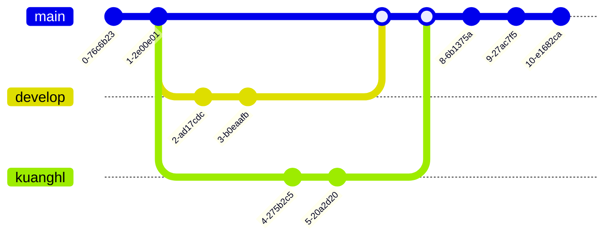
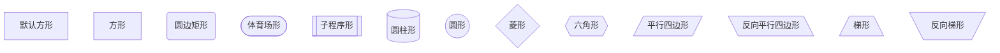

[『Cmd record my life』](https://kuanghl98.github.io/ "kuanghl Cmd 在线 Markdown 编辑阅读器")


<!-- @import "[TOC]" {cmd="toc" depthFrom=1 depthTo=6 orderedList=false} -->

<!-- code_chunk_output -->

- [Cmd Markdown 简明语法手册](#cmd-markdown-简明语法手册)
    - [1. 分割线](#1-分割线)
    - [2. 斜体和粗体、高亮](#2-斜体和粗体-高亮)
    - [3. 分级标题](#3-分级标题)
    - [4. 外链接](#4-外链接)
    - [5. 无序列表](#5-无序列表)
    - [6. 有序列表](#6-有序列表)
    - [7. 文字引用](#7-文字引用)
        - [7.1. 要做目录前一行创建喵点](#71-要做目录前一行创建喵点)
        - [7.2. 测试目录](#72-测试目录)
        - [7.3. 这里引用瞄点，括号里的值与上面的id后的值相等。](#73-这里引用瞄点括号里的值与上面的id后的值相等)
    - [8. 行内代码块](#8-行内代码块)
    - [9. 代码块](#9-代码块)
    - [10. 插入图像](#10-插入图像)
- [Cmd Markdown 高阶语法手册](#cmd-markdown-高阶语法手册)
    - [11. 内容目录](#11-内容目录)
    - [12. 标签分类](#12-标签分类)
    - [13. 删除线](#13-删除线)
    - [14. 注脚缩略](#14-注脚缩略)
    - [15. LaTeX 公式](#15-latex-公式)
    - [16. 加强的代码块](#16-加强的代码块)
    - [17. 流程图](#17-流程图)
      - [17.1. 示例1](#171-示例1)
      - [17.2. 示例2](#172-示例2)
      - [17.3. 更多语法参考：流程图语法参考](#173-更多语法参考流程图语法参考httpadraigithubioflowchartjs)
    - [18. 序列图](#18-序列图)
      - [18.1. 示例 1](#181-示例-1)
      - [18.2. 示例 2](#182-示例-2)
      - [18.3. 更多语法参考：序列图语法参考](#183-更多语法参考序列图语法参考httpbrampgithubiojs-sequence-diagrams)
    - [19. 甘特图](#19-甘特图)
      - [19.1. 更多语法参考：甘特图语法参考](#191-更多语法参考甘特图语法参考httpsknsvgithubiomermaidgant-diagrams)
    - [20. Mermaid 流程图](#20-mermaid-流程图)
      - [20.1. 示例1](#201-示例1)
      - [20.2. 示例2](#202-示例2)
      - [20.3. 示例3](#203-示例3)
      - [20.4. 更多语法参考：Mermaid 流程图语法参考](#204-更多语法参考mermaid-流程图语法参考httpsknsvgithubiomermaidflowcharts-basic-syntax)
    - [21. Mermaid 序列图](#21-mermaid-序列图)
      - [21.1. 示例1(时序图)](#211-示例1时序图)
      - [21.2. 示例2(类图)](#212-示例2类图)
      - [21.3. 示例3(饼图)](#213-示例3饼图)
      - [21.4. 示例4(状态图)](#214-示例4状态图)
        - [21.4.1. eg0:](#2141-eg0)
        - [21.4.2. eg1:](#2142-eg1)
        - [21.4.3. eg2:](#2143-eg2)
        - [21.4.4. eg3:](#2144-eg3)
      - [21.5. 示例5(ER图)](#215-示例5er图)
      - [21.6. 示例6(git图)](#216-示例6git图)
      - [21.7. 示例7(图形)](#217-示例7图形)
      - [21.8. 示例8(旅行图)](#218-示例8旅行图)
      - [21.9. 示例9(脑图)](#219-示例9脑图)
      - [21.10. 更多语法参考：Mermaid 序列图语法参考](#2110-更多语法参考mermaid-序列图语法参考httpsknsvgithubiomermaidsequence-diagrams)
    - [22. 表格支持](#22-表格支持)
    - [23. 定义型列表](#23-定义型列表)
    - [24. Html 标签](#24-html-标签)
    - [25. 内嵌图标](#25-内嵌图标)
    - [26. 待办事宜 Todo 列表](#26-待办事宜-todo-列表)
    - [27. 表情图标](#27-表情图标)

<!-- /code_chunk_output -->


# Cmd Markdown 简明语法手册

标签： Cmd-Markdown
### 1. 分割线

---
***
___


### 2. 斜体和粗体、高亮

使用 * 和 ** 表示斜体和粗体。

示例：

这是 *斜体*，这是 **粗体**，这是==高亮==。

### 3. 分级标题

使用 === 表示一级标题，使用 --- 表示二级标题。

示例：

```
这是一个一级标题
============================

这是一个二级标题
--------------------------------------------------

### 这是一个三级标题
```

你也可以选择在行首加井号表示不同级别的标题 (H1-H6)，例如：# H1, ## H2, ### H3，#### H4。

### 4. 外链接

使用 \[描述](链接地址) 为文字增加外链接。

示例：

这是去往 [本人博客](http://ghosertblog.github.com) 的链接。

### 5. 无序列表

使用 *，+，- 表示无序列表。

示例：

- 无序列表项 一
- 无序列表项 二
- 无序列表项 三

### 6. 有序列表

使用数字和点表示有序列表。

示例：

1. 有序列表项 一
2. 有序列表项 二
3. 有序列表项 三

### 7. 文字引用

使用 > 表示文字引用。

示例：

> 野火烧不尽，春风吹又生。

跳转示例：

##### 7.1. 要做目录前一行创建喵点
<a id='test'></a>
##### 7.2. 测试目录
测试目录
##### 7.3. 这里引用瞄点，括号里的值与上面的id后的值相等。
[测试](#test)

### 8. 行内代码块

使用 \`代码` 表示行内代码块。

示例：

让我们聊聊 `html`。

### 9. 代码块

使用 四个缩进空格 表示代码块。

示例：

    这是一个代码块，此行左侧有四个不可见的空格。

### 10. 插入图像

使用 \!\[描述](图片链接地址) 插入图像。

示例：

# Cmd Markdown 高阶语法手册

### 11. 内容目录

在段落中填写 `[TOC]` 以显示全文内容的目录结构。

[TOC]

### 12. 标签分类

在编辑区任意行的列首位置输入以下代码给文稿标签：

标签： 数学 英语 Markdown

或者

Tags： 数学 英语 Markdown

### 13. 删除线

使用 ~~ 表示删除线。

~~这是一段错误的文本。~~

### 14. 注脚缩略

使用 [^keyword] 表示注脚。

这是一个注脚[^1]的样例。

这是第二个注脚[^2]的样例。

*[HTML]: Hyper Text Markup Language
*[W3C]: World Wide Web Consortium
The HTML 缩略 specification
is maintained by the W3C 缩略.

### 15. LaTeX 公式

$ 表示行内公式： 

质能守恒方程可以用一个很简洁的方程式 $E=mc^2$ 来表达。

$$ 表示整行公式：

$$\sum_{i=1}^n a_i=0$$

$$f(x_1,x_x,\ldots,x_n) = x_1^2 + x_2^2 + \cdots + x_n^2 $$

$$\sum^{j-1}_{k=0}{\widehat{\gamma}_{kj} z_k}$$

$ \Gamma(z) = \int_0^\infty t^{z-1}e^{-t}dt\,. $

$$\Gamma(z) = \int_0^\infty t^{z-1}e^{-t}dt\,.$$

$$\binom{n+1}{2k} $$


访问 [MathJax](http://meta.math.stackexchange.com/questions/5020/mathjax-basic-tutorial-and-quick-reference) 参考更多使用方法。

### 16. 加强的代码块

支持四十一种编程语言的语法高亮的显示，行号显示。

非代码示例：

```
$ sudo apt-get install vim-gnome
```

Python 示例：

```python{.line-numbers}
@requires_authorization
def somefunc(param1='', param2=0):
    '''A docstring'''
    if param1 > param2: # interesting
        print 'Greater'
    return (param2 - param1 + 1) or None

class SomeClass:
    pass

>>> message = '''interpreter
... prompt'''
```

JavaScript 示例：

``` javascript
/**
* nth element in the fibonacci series.
* @param n >= 0
* @return the nth element, >= 0.
*/
function fib(n) {
  var a = 1, b = 1;
  var tmp;
  while (--n >= 0) {
    tmp = a;
    a += b;
    b = tmp;
  }
  return a;
}

document.write(fib(10));
```

### 17. 流程图

#### 17.1. 示例1

```flow
st=>start: Start:>https://www.zybuluo.com
io=>inputoutput: verification
op=>operation: Your Operation
cond=>condition: Yes or No?
sub=>subroutine: Your Subroutine
e=>end

st->io->op->cond
cond(yes)->e
cond(no)->sub->io
```

#### 17.2. 示例2

```flow
   st=>start: Start|past:>http://www.google.com[blank]
   e=>end: End:>http://www.google.com
   op1=>operation: get_hotel_ids|past
   op2=>operation: get_proxy|current
   sub1=>subroutine: get_proxy|current
   op3=>operation: save_comment|current
   op4=>operation: set_sentiment|current
   op5=>operation: set_record|current
   cond1=>condition: ids_remain空?
   cond2=>condition: proxy_list空?
   cond3=>condition: ids_got空?
   cond4=>condition: 爬取成功??
   cond5=>condition: ids_remain空?
   io1=>inputoutput: ids-remain
   io2=>inputoutput: proxy_list
   io3=>inputoutput: ids-got
   st->op1(right)->io1->cond1
   cond1(yes)->sub1->io2->cond2
   cond2(no)->op3
   cond2(yes)->sub1
   cond1(no)->op3->cond4
   cond4(yes)->io3->cond3
   cond4(no)->io1
   cond3(no)->op4
   cond3(yes, right)->cond5
   cond5(yes)->op5
   cond5(no)->cond3
   op5->e
```


#### 17.3. 更多语法参考：[流程图语法参考](http://adrai.github.io/flowchart.js/)

### 18. 序列图

#### 18.1. 示例 1
```sequence
title:communication
 
participant main
participant FuncA as A
participant FuncB as B
 
A-->B:
B->main:sendmessage
Note over A:NOTE_A
Note right of B:NOTE_B
```


```sequence
Alice->Bob: Hello Bob, how are you?
Note right of Bob: Bob thinks
Bob-->Alice: I am good thanks!
```

#### 18.2. 示例 2

```sequence
Title: Here is a title
A->B: Normal line
B-->C: Dashed line
C->>D: Open arrow
D-->>A: Dashed open arrow
```

#### 18.3. 更多语法参考：[序列图语法参考](http://bramp.github.io/js-sequence-diagrams/)

### 19. 甘特图

甘特图内在思想简单。基本是一条线条图，横轴表示时间，纵轴表示活动（项目），线条表示在整个期间上计划和实际的活动完成情况。它直观地表明任务计划在什么时候进行，及实际进展与计划要求的对比。


#### 19.1. 更多语法参考：[甘特图语法参考](https://knsv.github.io/mermaid/#gant-diagrams)

### 20. Mermaid 流程图

#### 20.1. 示例1


#### 20.2. 示例2


#### 20.3. 示例3


#### 20.4. 更多语法参考：[Mermaid 流程图语法参考](https://knsv.github.io/mermaid/#flowcharts-basic-syntax)

### 21. Mermaid 序列图

#### 21.1. 示例1(时序图)


#### 21.2. 示例2(类图)


#### 21.3. 示例3(饼图)


#### 21.4. 示例4(状态图)
##### 21.4.1. eg0:

##### 21.4.2. eg1:

##### 21.4.3. eg2:

##### 21.4.4. eg3:


#### 21.5. 示例5(ER图)


#### 21.6. 示例6(git图)


#### 21.7. 示例7(图形)


#### 21.8. 示例8(旅行图)


#### 21.9. 示例9(脑图)


#### 21.10. 更多语法参考：[Mermaid 序列图语法参考](https://knsv.github.io/mermaid/#sequence-diagrams)

### 22. 表格支持

| 项目        | 价格   |  数量  |  表  |
| :--------:   | :-----  | :----:  | :---:|
| 计算机     | \$1600 |   5     | 尚未 |
| 手机        |   \$12   |   12   | 合并 |
| 管线        |    \$1    |  234  | 方法 |


### 23. 定义型列表

名词 1
:   定义 1（左侧有一个可见的冒号和四个不可见的空格）

代码块 2
:   这是代码块的定义（左侧有一个可见的冒号和四个不可见的空格）

        代码块（左侧有八个不可见的空格）

### 24. Html 标签

本站支持在 Markdown 语法中嵌套 Html 标签，譬如，你可以用 Html 写一个纵跨两行的表格：

    <table>
        <tr>
            <th rowspan="2">值班人员</th>
            <th>星期一</th>
            <th>星期二</th>
            <th>星期三</th>
        </tr>
        <tr>
            <td>李强</td>
            <td>张明</td>
            <td>王平</td>
        </tr>
    </table>

```
1. 结论：'使用 html 语法'（Markdown 支持 html 语法）
   (1) rowspan: 将两个或多个 '行' 合并为一个行
   (2) colspan: 将两个或多个 '列' 合并为一个列
   
2. 说明：在 Markdown 编辑器中，如 csdn 博客，给定的 "表格" 不支持合并
        但可以通过 html 语法来实现
eg.
<table border="1">
    <tr>
        <th align="left">标题 1</th>   <!-- 左对齐 -->
        <th align="center">标题 2</th> <!-- 居中对其（默认）-->
        <th align="right">标题 3</th>  <!-- 右对齐-->
    </tr>
    <tr>
        <td rowspan="2">col 11</td>
        <td>col 12</td>
        <td>col 13</td>
    </tr>
    <tr>
        <td>col 22</td>
        <td>col 23</td>
    </tr>
</table>

```
eg0.
<table>
    <tr>
        <th rowspan="2">值班人员</th>
        <th>星期一</th>
        <th>星期二</th>
        <th>星期三</th>
    </tr>
    <tr>
        <td>李强</td>
        <td>张明</td>
        <td>王平</td>
    </tr>
</table>

eg1. 
<table>
	<tr>
	    <th>属性</th>
	    <th>属性值</th>
	    <th>描述</th>  
	</tr >
	<tr >
	    <td rowspan="9">type</td>
	    <td>text</td>
	    <td>单行文本输入框</td>
	</tr>
	<tr>
	    <td>password</td>
	    <td>密码输入框</td>
	</tr>
	<tr>
	    <td>radio</td>
	    <td>单选按钮</td>
	</tr>
	<tr>
	    <td>CheckBox</td>
	    <td>复选按钮</td>
	</tr>
	<tr><td>button</td>
	    <td>普通按钮</td>
	</tr>
	<tr>
	    <td>submit</td>
	    <td>提交按钮</td>
	</tr>
	<tr>
	    <td>reset</td>
	    <td>重置按钮</td>
	</tr>
	<tr>
	    <td>image</td>
	    <td>图像形式的提交按钮</td>
	</tr>
	<tr>
	    <td >file</td>
	    <td>文件域</td>
	</tr>
	<tr>
	    <td >name</td>
	    <td>用户自定义</td>
	    <td>控件名称</td>
	</tr>
	<tr>
	    <td >value</td>
	    <td >用户自定义</td>
	    <td >默认文本值</td>
	</tr>
	<tr>
	    <td >size</td>
	    <td >正整数</td>
	    <td >控件在页面中的显示宽度</td>
	</tr>
	<tr>
	    <td >checked</td>
	    <td >checked</td>
	    <td >定义选择控件默认被选中项</td>
	</tr>
	<tr>
	    <td >maxlength</td>
	    <td >正整数</td>
	    <td >控件允许输入的最多字符</td>
	</tr>
</table>

eg2.
$$
\begin{array}
{cll}
\hline
	序号 & 人名 & 角色 \\
\hline
	1 & Alice    & 协议中的第一个参与者 \\
	2 & Bob      & 协议中的第二个参与者 \\
	3 & Trent    & 仲裁者 \\
	4 & Eve      & 窃听者 \\
\hline	
\end{array}
$$


### 25. 内嵌图标

本站的图标系统对外开放，在文档中输入

    <i class="icon-weibo"></i>

即显示微博的图标： <i class="icon-weibo icon-2x"></i>

替换 上述 `i 标签` 内的 `icon-weibo` 以显示不同的图标，例如：

    <i class="icon-renren"></i>

即显示人人的图标： <i class="icon-renren icon-2x"></i>

更多的图标和玩法可以参看 [font-awesome](http://fortawesome.github.io/Font-Awesome/3.2.1/icons/) 官方网站。

### 26. 待办事宜 Todo 列表

使用带有 [ ] 或 [x] （未完成或已完成）项的列表语法撰写一个待办事宜列表，并且支持子列表嵌套以及混用Markdown语法，例如：

    - [ ] **Cmd Markdown 开发**
        - [ ] 改进 Cmd 渲染算法，使用局部渲染技术提高渲染效率
        - [ ] 支持以 PDF 格式导出文稿
        - [x] 新增Todo列表功能 [语法参考](https://github.com/blog/1375-task-lists-in-gfm-issues-pulls-comments)
        - [x] 改进 LaTex 功能
            - [x] 修复 LaTex 公式渲染问题
            - [x] 新增 LaTex 公式编号功能 [语法参考](http://docs.mathjax.org/en/latest/tex.html#tex-eq-numbers)
    - [ ] **七月旅行准备**
        - [ ] 准备邮轮上需要携带的物品
        - [ ] 浏览日本免税店的物品
        - [x] 购买蓝宝石公主号七月一日的船票
        
对应显示如下待办事宜 Todo 列表：
        
- [ ] **Cmd Markdown 开发**
    - [ ] 改进 Cmd 渲染算法，使用局部渲染技术提高渲染效率
    - [ ] 支持以 PDF 格式导出文稿
    - [x] 新增Todo列表功能 [语法参考](https://github.com/blog/1375-task-lists-in-gfm-issues-pulls-comments)
    - [x] 改进 LaTex 功能
        - [x] 修复 LaTex 公式渲染问题
        - [x] 新增 LaTex 公式编号功能 [语法参考](http://docs.mathjax.org/en/latest/tex.html#tex-eq-numbers)
- [ ] **七月旅行准备**
    - [ ] 准备邮轮上需要携带的物品
    - [ ] 浏览日本免税店的物品
    - [x] 购买蓝宝石公主号七月一日的船票

### 27. 表情图标

||a|b|c|d|e|f|
|:--:|:--:|:--:|:--:|:--:|:--:|:--:|
|1|:punch:|:notebook:|:e-mail:|:smile:|:movie_camera:|	:camera:|
|2|:fa-car:|:telephone_receiver:|:phone:|:heart:|:alarm_clock:|:loop:|
|3|:+1:|:books:|:email:|:-1:|:bulb:|:hammer:|
|4|:rocket:|:book:|:envelope:|:sunny:|:mag_right:|	:chart_with_upwards_trend:|
|5|:cloud:|:bar_chart:|:wind_chime:|:hibiscus:|:paperclip:|	:ghost:|
|6|:bug:|:date:|:balloon:|:beers:|:guitar:|:headphones:|
|7|:rice:|:guitar:|:mortar_board:|:house:|:mount_fuji:|	:office:|
|8|:rocket:|:school:|:cupid:|:notes:|:shit:|:feet:|
|9|:speech_balloon:| 

:smile: :flushed: :sweat: :sob: :joy:

:+1: :ok_hand: :point_down: :clap: :muscle: :pray:

:heart: :fire: :boom: :star2: :shit: :zzz:    
        
[^1]: 这是一个 *注脚* 的 **文本**。

[^2]: 这是另一个 *注脚* 的 **文本**。
