### 1. [参考](https://shd101wyy.github.io/markdown-preview-enhanced/#/zh-cn/toc)
### 2. 基本文字格式
简述markdown使用天然的对html语法支持,所有如果有些复杂渲染毕竟难实现,可以考虑通过网页前端代码提高便捷性
#### 2.1. 标题
- ==code==
  ```md
  - 这是无序列表标题1
  - 这是无序列表标题2
  - 这是无序列表标题3

  - [ ] 这是未完成任务列表标题1
  - [ ] 这是未完成任务列表标题2
  - [ ] 这是未完成任务列表标题3

  - [x] 这是已完成列表标题1
  - [x] 这是已完成列表标题2
  - [x] 这是已完成列表标题3

  1. 这是有序标题1
  2. 这是有序标题2
  3. 这是有序标题3

  # 这是 <h1> 一级标题
  ## 这是 <h2> 二级标题
  ### 这是 <h3> 三级标题
  #### 这是 <h4> 四级标题
  ##### 这是 <h5> 五级标题
  ###### 这是 <h6> 六级标题

  [TOC] 这是目录
  
  目录
  ---
  toc:
    depth_from: 1
    depth_to: 6
    ordered: false
  ---
  ```
- ==print==
  - 这是无序列表标题1
  - 这是无序列表标题2
  - 这是无序列表标题3

  - [ ] 这是未完成任务列表标题1
  - [ ] 这是未完成任务列表标题2
  - [ ] 这是未完成任务列表标题3

  - [x] 这是已完成列表标题1
  - [x] 这是已完成列表标题2
  - [x] 这是已完成列表标题3

  1. 这是有序标题1
  2. 这是有序标题2
  3. 这是有序标题3


#### 2.2. 文字表述

- ==code== 
  ```md
  *这会是 斜体 的文字*
  _这会是 斜体 的文字_

  **这会是 粗体 的文字**
  __这会是 粗体 的文字__

  _你也 **组合** 这些符号_

  ~~这个文字将会被横线删除~~

  ==高亮文字==

  30^上标^
  H~下标~O

  > 这是一个注释

  `代码块`
 
  \`\`\`
  #include <stdio.h>
  //代码块
  \`\`\`

  \`\`\`{.line-numbers}
  #include <stdio.h>
  //代码块显示行数
  \`\`\`

  \`\`\`c {highlight=[1-10,15,20-22]}
  /******************************************************************************
   * Name:    CRC-8               x8+x2+x+1
   * Poly:    0x07
   * Init:    0x00
   * Refin:   False
   * Refout:  False
   * Xorout:  0x00
   * Note: 高亮指定代码行数
   *****************************************************************************/
  uint8_t crc8(uint8_t *data, uint32_t length)
  {
      uint8_t i;
      uint8_t crc = 0;        // Initial value
      while(length--)
      {
          crc ^= *data++;        // crc ^= *data; data++;
          for ( i = 0; i < 8; i++ )
          {
              if ( crc & 0x80 )
                  crc = (crc << 1) ^ 0x07;
              else
                  crc <<= 1;
          }
      }
      return crc;
  }
  \`\`\`

  \`\`\`这是转义符

  脚注1[^1]
  脚注1[^2]
  [^1]: Hi! 脚注1
  [^2]: Hi! 脚注2

  *[简述]: 一大堆备注缩略成简述
  这是一个 简述 引用

  !!! note
      这是一条警告

  不缩进
  &nbsp;&nbsp;&nbsp;小缩进
  &emsp;大缩进
  ```

- ==print==
    *这会是 斜体 的文字*
    _这会是 斜体 的文字_

    **这会是 粗体 的文字**
    __这会是 粗体 的文字__

    _你也 **组合** 这些符号_

    ~~这个文字将会被横线删除~~

    ==高亮文字==

    30^上标^
    H~下标~O

    `代码块`

    ```c
    #include <stdio.h>
    //代码块
    ```

    ```c{.line-numbers}
    #include <stdio.h>
    //代码块显示行数
    ```

    ```c {highlight=[1-10,15,20-22]}
      /******************************************************************************
       * Name:    CRC-8               x8+x2+x+1
       * Poly:    0x07
       * Init:    0x00
       * Refin:   False
       * Refout:  False
       * Xorout:  0x00
       * Note: 高亮指定代码行数
       *****************************************************************************/
      uint8_t crc8(uint8_t *data, uint32_t length)
      {
          uint8_t i;
          uint8_t crc = 0;        // Initial value
          while(length--)
          {
              crc ^= *data++;        // crc ^= *data; data++;
              for ( i = 0; i < 8; i++ )
              {
                  if ( crc & 0x80 )
                      crc = (crc << 1) ^ 0x07;
                  else
                      crc <<= 1;
              }
          }
          return crc;
      }
    ```

    > 这是一个注释或引用

    \`\`\`这是转义符

    脚注1[^1]
    脚注1[^2]
    [^1]: Hi! 脚注1
    [^2]: Hi! 脚注2

    *[简述]: 一大堆备注缩略成简述
    这是一个 简述 引用

    !!! note
      这是一条警告

    不缩进
    &nbsp;&nbsp;&nbsp;小缩进
    &emsp;大缩进

#### 2.3. 跳转

- ==code==
  ```md
  [这是一条链接](https://github.com/kuanghl/kuanghl)
  
  <a id='jumpid1'></a>
  [这是一个页内跳转](#jumpid1)
  ```

- print
  [这是一条链接](https://github.com/kuanghl/kuanghl)

  

  <a id='jumpid1'></a>
  [这是一个页内跳转](#jumpid1)


#### 2.4. 其他

- ==code== 
  ```md
  # 这是三根分割线
  ---
  ***
  ___

  # 这是一些表情符号
  ||a|b|c|d|e|f|
  |:--:|:--:|:--:|:--:|:--:|:--:|:--:|
  |1|:punch:|:notebook:|:e-mail:|:smile:|:movie_camera:|	:camera:|
  |2|:fa-car:|:telephone_receiver:|:phone:|:heart:|:alarm_clock:|:loop:|
  |3|:+1:|:books:|:email:|:-1:|:bulb:|:hammer:|
  |4|:rocket:|:book:|:envelope:|:sunny:|:mag_right:|	:chart_with_upwards_trend:|
  |5|:cloud:|:bar_chart:|:wind_chime:|:hibiscus:|:paperclip:|	:ghost:|
  |6|:bug:|:date:|:balloon:|:beers:|:guitar:|:headphones:|
  |7|:rice:|:guitar:|:mortar_board:|:house:|:mount_fuji:|	:office:|
  |8|:rocket:|:school:|:cupid:|:notes:|:shit:|:feet:|
  |9|:speech_balloon:| 

  :smile: :flushed: :sweat: :sob: :joy:
  :+1: :ok_hand: :point_down: :clap: :muscle: :pray:
  :heart: :fire: :boom: :star2: :shit: :zzz:    

  # 这是表格(合并表格只能使用HTML)
  | 姓名 | 年龄 |  爱好 |
  | :-- | :-- | -----: |
  | 小明 | 9 | 篮球、羽毛球、乒乓球 |
  | 小刚 | 10 | 篮球 <br> 足球 |

  # 这是一个固定代码块解析格式
  s名词 1
  :   定义 1(左侧有一个可见的冒号和四个不可见的空格)
      定义 2
      定义 3
            
        #include <stdio.h>
        // 这是代码块(左侧有八个不可见的空格)

  # 导入文件(需要点击预览界面的右上角刷新预览来同步变更导入文件的改变)
  @import "../json/test.md"
  @import "../json/test.js"
  @import "../json/test.csv
  @import "../json/test.json"
  @import "../json/test.pdf"

  # 这是一个导出pdf分页的标志
  <div STYLE="page-break-after: always;"></div>
  ```

- ==print==

  ---
  ***
  ___

  ||a|b|c|d|e|f|
  |:--:|:--:|:--:|:--:|:--:|:--:|:--:|
  |1|:punch:|:notebook:|:e-mail:|:smile:|:movie_camera:|	:camera:|
  |2|:fa-car:|:telephone_receiver:|:phone:|:heart:|:alarm_clock:|:loop:|
  |3|:+1:|:books:|:email:|:-1:|:bulb:|:hammer:|
  |4|:rocket:|:book:|:envelope:|:sunny:|:mag_right:|	:chart_with_upwards_trend:|
  |5|:cloud:|:bar_chart:|:wind_chime:|:hibiscus:|:paperclip:|	:ghost:|
  |6|:bug:|:date:|:balloon:|:beers:|:guitar:|:headphones:|
  |7|:rice:|:guitar:|:mortar_board:|:house:|:mount_fuji:|	:office:|
  |8|:rocket:|:school:|:cupid:|:notes:|:shit:|:feet:|
  |9|:speech_balloon:| 

  :smile: :flushed: :sweat: :sob: :joy:
  :+1: :ok_hand: :point_down: :clap: :muscle: :pray:
  :heart: :fire: :boom: :star2: :shit: :zzz:    

  | 姓名 | 年龄 |  爱好 |
  | :-- | :-- | -----: |
  | 小明 | 9 | 篮球、羽毛球、乒乓球 |
  | 小刚 | 10 | 篮球 <br> 足球 |

  名词 1
  :   定义 1(左侧有一个可见的冒号和四个不可见的空格)
      定义 2
      定义 3
            
        #include <stdio.h>
        // 这是代码块(左侧有八个不可见的空格)
  
  @import "../json/test.md"
  @import "../json/test.csv"

### 3. 基本公式

#### 3.1. KaTex
#### 3.2. MathJax
#### 3.3. Latex
$$
\begin{array}
{cll}
\hline
	序号 & 人名 & 角色 \\
\hline
	1 & Alice    & 协议中的第一个参与者 \\
	2 & Bob      & 协议中的第二个参与者 \\
	3 & Trent    & 仲裁者 \\
	4 & Eve      & 窃听者 \\
\hline	
\end{array}
$$

`$` 表示行内公式,如最简单的质能方程$E=mc^2$展示
`$$` 表示整行公式：

$$\sum_{i=1}^n a_i=0$$

$$f(x_1,x_x,\ldots,x_n) = x_1^2 + x_2^2 + \cdots + x_n^2 $$

$$\sum^{j-1}_{k=0}{\widehat{\gamma}_{kj} z_k}$$

$\Gamma(z) = \int_0^\infty t^{z-1}e^{-t}dt\,.$

$$\Gamma(z) = \int_0^\infty t^{z-1}e^{-t}dt\,.$$

$$\binom{n+1}{2k} $$

$$
\color{#FF0000}{红} 
\color{#FF7D00}{橙} 
\color{#FF0000}{黄} 
\color{#00FF00}{绿}
\color{#0000FF}{蓝} 
\color{#00FFFF}{靛} 
\color{#FF00FF}{紫}
$$

#### 3.4. 代码块渲染

- Code Chunk(需要配置略)


### 4. 基本绘图

#### 4.1. [Mermaid(flowchart/gantt/sequenceDiagram/classDiagram/stateDiagram-v2/journey/C4Context)](https://github.com/mermaid-js/mermaid.git)

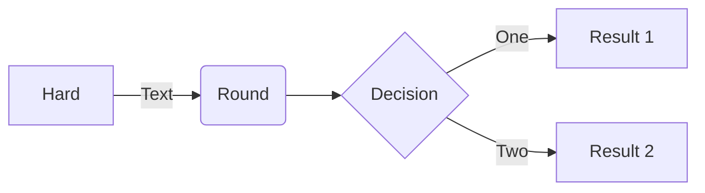
  
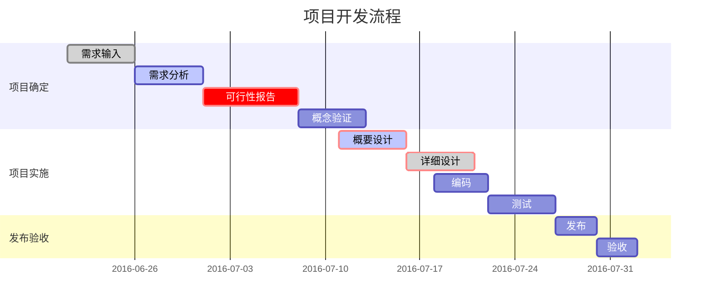

```mermaid
gantt
    title Git Issues - days since last update
    dateFormat  X
    axisFormat %s

    section Issue19062
    71   : 0, 71
    section Issue19401
    36   : 0, 36
    section Issue193
    34   : 0, 34
    section Issue7441
    9    : 0, 9
    section Issue1300
    5    : 0, 5
```

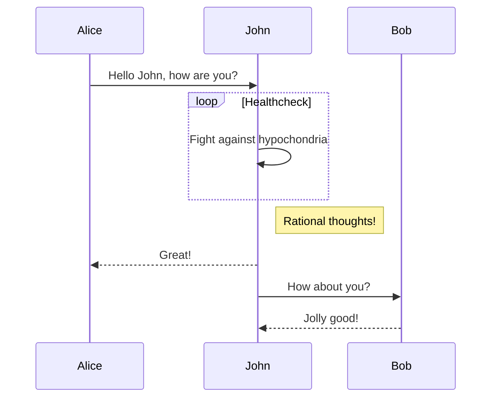

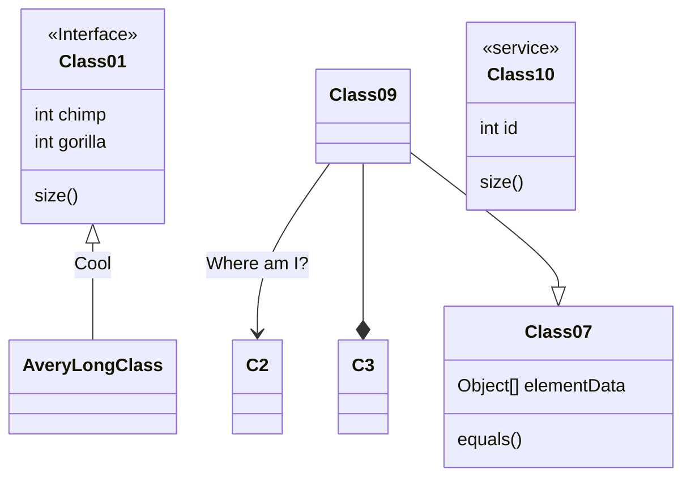

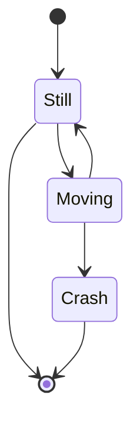

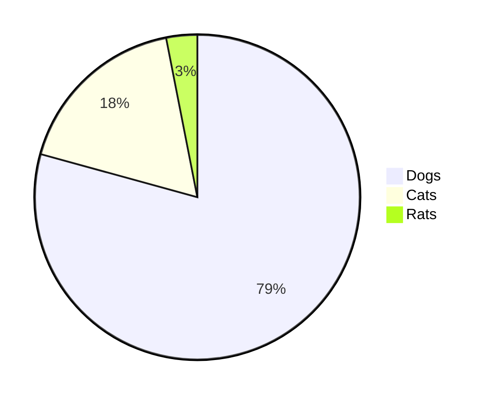

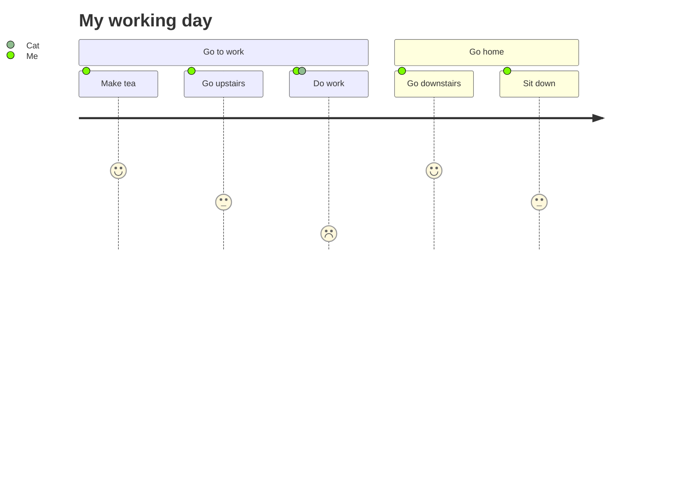

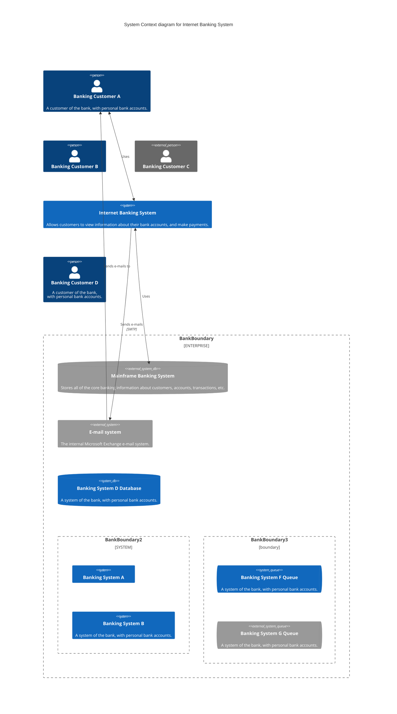

#### 4.2. [wavedrom(assign/reg/signal)](https://github.com/wavedrom/wavedrom.git)
  
```wavedrom
{ assign:[
  ["z", ["~&",
    ["~^", ["~", "p0"], ["~", "q0"]],
    ["~^", ["~", "p1"], ["~", "q1"]],
    ["~^", ["~", "p2"], ["~", "q2"]],
    "...",
    ["~^", ["~", "p7"], ["~", "q7"]],
    ["~","~en"]
  ]]
]}
```

```wavedrom
{reg:[
    {bits: 7,  name: 0x07, attr: [
      'VLxU,VLE zero-extended',
      'VLxU,VLE zero-extended, fault-only-first',
      'VLxU sign-extended',
      'VLxU sign-extended, fault-only-first',
    ]},
    {bits: 5,  name: 'vd', attr: 'destination of load', type: 2},
    {bits: 3,  name: 'width'},
    {bits: 5,  name: 'rs1', attr: 'base address', type: 4},
    {bits: 5,  name: 'lumop', attr: [0, 16, 0, 16]},
    {bits: 1,  name: 'vm'},
    {bits: 3,  name: 'mop', attr: [0, 0, 4, 4]},
    {bits: 3,  name: 'nf'},
]}
```

```wavedrom
{reg: [
    {bits: 7,  name: 0x37, attr: ['OPIVI']},
    {bits: 5,  name: 'vd', type: 2},
    {bits: 3,  name: 3},
    {bits: 5,  name: 'simm5', type: 5},
    {bits: 5,  name: 'vs2', type: 2},
    {bits: 1,  name: 'vm'},
    {bits: 6,  name: 'funct6'},
]}
```

```wavedrom
{ signal: [
  { name: "clk",         wave: "p.....|..." },
  { name: "Data",        wave: "x.345x|=.x", data: ["head", "body", "tail", "data"] },
  { name: "Request",     wave: "0.1..0|1.0" },
  {},
  { name: "Acknowledge", wave: "1.....|01." }
]}
```

```wavedrom
{ signal: [
  { name: 'A', wave: '01........0....',  node: '.a........j' },
  { name: 'B', wave: '0.1.......0.1..',  node: '..b.......i' },
  { name: 'C', wave: '0..1....0...1..',  node: '...c....h..' },
  { name: 'D', wave: '0...1..0.....1.',  node: '....d..g...' },
  { name: 'E', wave: '0....10.......1',  node: '.....ef....' }
  ],
  edge: [
    'a~b t1', 'c-~a t2', 'c-~>d time 3', 'd~-e',
    'e~>f', 'f->g', 'g-~>h', 'h~>i some text', 'h~->j'
  ],
  config:{skin:'lowkey'}
}
```

```wavedrom
{ signal: [
  { name: 'Reset',
   wave:  '01|...=...|01u', data: ['a < b'],

   node: '...........E...' },
  {},
  { name: 'Input',
      wave: 'x0|.1x....|.0d',
      node: '....A.F.......' },
  {},
  { name: 'Output',
      wave: '0.|......1|0.d',
      node: '.........C.F..' },

  {   node: '....B....D.....' },
  ],
  edge: [
    'A-B', 'C-D', 'A~>C', 'B<->D T > 45s', 'E->F'
  ]
}
```


#### 4.3. [bitfield](https://github.com/wavedrom/bitfield.git)

```bitfield
[
    { "name": "IPO",   "bits": 8, "attr": "RO" },
    {                  "bits": 7 },
    { "name": "BRK",   "bits": 5, "attr": "RW", "type": 4 },
    { "name": "CPK",   "bits": 1 },
    { "name": "Clear", "bits": 3 },
    { "bits": 8 }
]
```


#### 4.4. [GraphViz](https://en.wikipedia.org/wiki/DOT_(graph_description_language))

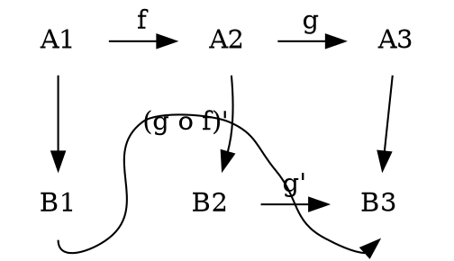

```viz{engine="circo"}
graph graphname {
    a -- b -- c;
    b -- d;
    b -- e;
}
```

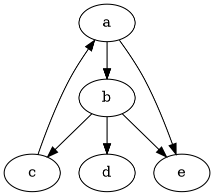

#### 4.5. [Vega](https://vega.github.io/vega/)/[Vega-lite](https://vega.github.io/vega-lite/)

```vega
{
  "$schema":"https://vega.github.io/schema/vega/v4.json",
  "width": 400, "height": 200,
  "data": [ {
    "name": "vals",
    "values": [
      {"category": "Oranges"},
      {"category": "Pears"},
      {"category": "Apples"},
      {"category": "Peaches"},
      {"category": "Bananas"},
      {"category": "Grapes"}
    ],
    "transform": [
      {"type": "formula", "as": "count", "expr": "random()*1000"}
    ]
  } ],
 "scales": [
    {
      "name": "yscale",
      "type": "linear",
      "zero": true,
      "domain": {"data": "vals", "field": "count"},
      "range": "height"
    },
    {
      "name": "xscale",
      "type": "band",
      "domain": {"data": "vals", "field": "category"},
      "range": "width",
      "padding": 0.05
    }
  ],
  "axes": [
    {"scale": "yscale", "orient": "left"},
    {"scale": "xscale", "orient": "bottom"}
  ],
  "marks": [ {
    "type": "rect",
    "from": { "data": "vals" },
    "encode": {
      "update": {
        "x":     {"scale": "xscale", "field": "category"},
        "width": {"scale": "xscale", "band": 1},
        "y":     {"scale": "yscale", "field": "count"},
        "y2":    {"scale": "yscale", "value": 0},
        "fill":  [
          {"test": "datum.count < 333", "value": "red"},
          {"test": "datum.count < 666", "value": "yellow"},
          {"value": "green"}
        ]
      }
    }
  } ]
}
```

```vega
{
  "$schema": "https://vega.github.io/schema/vega/v5.json",
  "width": 400,
  "height": 200,
  "padding": 5,

  "data": [
    {
      "name": "table",
      "values": [
        {"category": "A", "amount": 28},
        {"category": "B", "amount": 55},
        {"category": "C", "amount": 43},
        {"category": "D", "amount": 91},
        {"category": "E", "amount": 81},
        {"category": "F", "amount": 53},
        {"category": "G", "amount": 190},
        {"category": "H", "amount": 87}
      ]
    }
  ],

  "signals": [
    {
      "name": "tooltip",
      "value": {},
      "on": [
        {"events": "rect:mouseover", "update": "datum"},
        {"events": "rect:mouseout",  "update": "{}"}
      ]
    }
  ],

  "scales": [
    {
      "name": "xscale",
      "type": "band",
      "domain": {"data": "table", "field": "category"},
      "range": "width",
      "padding": 0.05,
      "round": true
    },
    {
      "name": "yscale",
      "domain": {"data": "table", "field": "amount"},
      "nice": true,
      "range": "height"
    }
  ],

  "axes": [
    { "orient": "bottom", "scale": "xscale" },
    { "orient": "left", "scale": "yscale" }
  ],

  "marks": [
    {
      "type": "rect",
      "from": {"data":"table"},
      "encode": {
        "enter": {
          "x": {"scale": "xscale", "field": "category"},
          "width": {"scale": "xscale", "band": 1},
          "y": {"scale": "yscale", "field": "amount"},
          "y2": {"scale": "yscale", "value": 0}
        },
        "update": {
          "fill": {"value": "steelblue"}
        },
        "hover": {
          "fill": {"value": "red"}
        }
      }
    },
    {
      "type": "text",
      "encode": {
        "enter": {
          "align": {"value": "center"},
          "baseline": {"value": "bottom"},
          "fill": {"value": "#333"}
        },
        "update": {
          "x": {"scale": "xscale", "signal": "tooltip.category", "band": 0.5},
          "y": {"scale": "yscale", "signal": "tooltip.amount", "offset": -2},
          "text": {"signal": "tooltip.amount"},
          "fillOpacity": [
            {"test": "datum === tooltip", "value": 0},
            {"value": 1}
          ]
        }
      }
    }
  ]
}
```

```vega-lite
{
"$schema": "https://vega.github.io/schema/vega-lite/v4.json",
"description": "A simple bar chart with embedded data.",
"width": 500,
"data": {
    "values": [
    {"a": "A", "b": 28}, {"a": "B", "b": 55}, {"a": "C", "b": 43},
    {"a": "D", "b": 91}, {"a": "E", "b": 81}, {"a": "F", "b": 53},
    {"a": "G", "b": 19}, {"a": "H", "b": 87}, {"a": "I", "b": 52}
    ]
},
"mark": "bar",
"encoding": {
    "x": {"field": "a", "type": "nominal", "axis": {"labelAngle": 0}},
    "y": {"field": "b", "type": "quantitative"}
}
}
```


```vega-lite
{
"$schema": "https://vega.github.io/schema/vega-lite/v4.json",
"description": "A simple bar chart with embedded data.",
"width": 500,
"data": {
    "values": [
    {"a": "A", "b": 28}, {"a": "B", "b": 55}, {"a": "C", "b": 43},
    {"a": "D", "b": 91}, {"a": "E", "b": 81}, {"a": "F", "b": 53},
    {"a": "G", "b": 19}, {"a": "H", "b": 87}, {"a": "I", "b": 52}
    ]
},
"mark": "line",
"encoding": {
    "x": {"field": "a", "type": "nominal", "axis": {"labelAngle": 0}},
    "y": {"field": "b", "type": "quantitative"}
}
}
```

```vega-lite
{
  "$schema": "https://vega.github.io/schema/vega-lite/v5.json",
  "width": 500,
  "data": {
    "values": [
      {
        "value": 0.5026,
        "serie": "bts",
        "category": "facebook",
        "color": "#2ccce4"
      },
      {
        "value": 0.357,
        "serie": "jungkook",
        "category": "facebook",
        "color": "#f47373"
      },
      {
        "value": 0.0967,
        "serie": "jimin",
        "category": "facebook",
        "color": "#37d67a"
      },
      {
        "value": 0.0437,
        "serie": "butter",
        "category": "facebook",
        "color": "#dce775"
      },
      {
        "value": 0.7923,
        "serie": "bts",
        "category": "news",
        "color": "#2ccce4"
      },
      {
        "value": 0,
        "serie": "jungkook",
        "category": "news",
        "color": "#f47373"
      },
      {
        "value": 0.0231,
        "serie": "jimin",
        "category": "news",
        "color": "#37d67a"
      },
      {
        "value": 0.1846,
        "serie": "butter",
        "category": "news",
        "color": "#dce775"
      },
      {
        "value": 0.6569,
        "serie": "bts",
        "category": "twitter",
        "color": "#2ccce4"
      },
      {
        "value": 0.0511,
        "serie": "jungkook",
        "category": "twitter",
        "color": "#f47373"
      },
      {
        "value": 0.0949,
        "serie": "jimin",
        "category": "twitter",
        "color": "#37d67a"
      },
      {
        "value": 0.1971,
        "serie": "butter",
        "category": "twitter",
        "color": "#dce775"
      },
      {
        "value": 1,
        "serie": "bts",
        "category": "blog",
        "color": "#2ccce4"
      },
      {
        "value": 0,
        "serie": "jungkook",
        "category": "blog",
        "color": "#f47373"
      },
      {
        "value": 0,
        "serie": "jimin",
        "category": "blog",
        "color": "#37d67a"
      },
      {
        "value": 0,
        "serie": "butter",
        "category": "blog",
        "color": "#dce775"
      },
      {
        "value": 1,
        "serie": "bts",
        "category": "instagram",
        "color": "#2ccce4"
      },
      {
        "value": 0,
        "serie": "jungkook",
        "category": "instagram",
        "color": "#f47373"
      },
      {
        "value": 0,
        "serie": "jimin",
        "category": "instagram",
        "color": "#37d67a"
      },
      {
        "value": 0,
        "serie": "butter",
        "category": "instagram",
        "color": "#dce775"
      }
    ]
  },
  "title": {},
  "encoding": {
    "y": {
      "field": "category",
      "axis": {
        "title": null
      }
    },
    "x": {
      "aggregate": "sum",
      "stack": "normalize",
      "field": "value",
      "axis": {
        "title": null,
        "grid": false
      }
    }
  },
  "layer": [
    {
      "mark": {
        "type": "bar"
      },
      "encoding": {
        "color": {
          "field": "serie",
          "scale": {
            "range": ["#2ccce4", "#dce775", "#37d67a", "#f47373"]
          },
          "legend": null
        },
        "tooltip": [
          {
            "field": "category",
            "type": "nominal"
          },
          {
            "field": "value",
            "type": "quantitative",
            "aggregate": "sum",
            "format": ".2%"
          },
          {
            "field": "serie",
            "type": "nominal"
          }
        ]
      }
    },
    {
      "mark": {
        "type": "text",
        "dx": -3,
        "align": "right",
        "color": "#000",
        "fontSize": 11
      },
      "encoding": {
        "detail": {
          "field": "serie"
        },
        "text": {
          "condition": {
            "test": "datum.value > 0.05",
            "type": "quantitative",
            "aggregate": "sum",
            "field": "value",
            "format": ".2%"
          },
          "value": ""
        }
      }
    }
  ],
  "config": {
    "view": {
      "stroke": "transparent"
    },
    "axis": {
      "domainWidth": 1
    }
  }
}
```

#### 4.6. [Kroki](https://kroki.io/)

```blockdiag {kroki=true}
blockdiag {
  Kroki -> generates -> "Block diagrams";
  Kroki -> is -> "very easy!";

  Kroki [color = "greenyellow"];
  "Block diagrams" [color = "pink"];
  "very easy!" [color = "orange"];
}
```

```TikZ {kroki=true}
\documentclass{article}
\usepackage{tikz}
\usepackage{tikz-3dplot}
\usetikzlibrary{math}
\usepackage[active,tightpage]{preview}
\PreviewEnvironment{tikzpicture}
\setlength\PreviewBorder{0.125pt}
%
% File name: directional-angles.tex
% Description: 
% The directional angles of a vector are geometrically represented.
% 
% Date of creation: July, 25th, 2021.
% Date of last modification: October, 9th, 2022.
% Author: Efra�n Soto Apolinar.
% https://www.aprendematematicas.org.mx/author/efrain-soto-apolinar/instructing-courses/
% Source: page 11 of the 
% Glosario Ilustrado de Matematicas Escolares.
% https://tinyurl.com/5udm2ufy
%
% Terms of use:
% According to TikZ.net
% https://creativecommons.org/licenses/by-nc-sa/4.0/
% Your commitment to the terms of use is greatly appreciated.
%
\begin{document}
  \tdplotsetmaincoords{80}{120}
  %
  \begin{tikzpicture}[tdplot_main_coords,scale=0.75] 
    % Indicate the components of the vector in rectangular coordinates
    \pgfmathsetmacro{\ux}{4}
    \pgfmathsetmacro{\uy}{4}
    \pgfmathsetmacro{\uz}{3}
    % Length of each axis
    \pgfmathsetmacro{\ejex}{\ux+0.5}
    \pgfmathsetmacro{\ejey}{\uy+0.5}
    \pgfmathsetmacro{\ejez}{\uz+0.5}
    \pgfmathsetmacro{\umag}{sqrt(\ux*\ux+\uy*\uy+\uz*\uz)} % Magnitude of vector $\vec{u}$
    % Compute the angle $\theta$
    \pgfmathsetmacro{\angthetax}{pi*atan(\uy/\ux)/180}
    \pgfmathsetmacro{\angthetay}{pi*atan(\ux/\uz)/180}
    \pgfmathsetmacro{\angthetaz}{pi*atan(\uz/\uy)/180}
    % Compute the angle $\phi$
    \pgfmathsetmacro{\angphix}{pi*acos(\ux/\umag)/180}
    \pgfmathsetmacro{\angphiy}{pi*acos(\uy/\umag)/180}
    \pgfmathsetmacro{\angphiz}{pi*acos(\uz/\umag)/180}
    % Compute rho sin(phi) to simplify computations
    \pgfmathsetmacro{\costz}{cos(\angthetax r)}
    \pgfmathsetmacro{\sintz}{sin(\angthetax r)}
    \pgfmathsetmacro{\costy}{cos(\angthetay r)}
    \pgfmathsetmacro{\sinty}{sin(\angthetay r)}
    \pgfmathsetmacro{\costx}{cos(\angthetaz r)}
    \pgfmathsetmacro{\sintx}{sin(\angthetaz r)}
    % Coordinate axis
    \draw[thick,->] (0,0,0) -- (\ejex,0,0) node[below left] {$x$};
    \draw[thick,->] (0,0,0) -- (0,\ejey,0) node[right] {$y$};
    \draw[thick,->] (0,0,0) -- (0,0,\ejez) node[above] {$z$};
    % Projections of the components in the axis
    \draw[gray,very thin,opacity=0.5] (0,0,0) -- (\ux,0,0) -- (\ux,\uy,0) -- (0,\uy,0) -- (0,0,0);	% face on the plane z = 0
    \draw[gray,very thin,opacity=0.5] (0,0,\uz) -- (\ux,0,\uz) -- (\ux,\uy,\uz) -- (0,\uy,\uz) -- (0,0,\uz);	% face on the plane z = \uz
    \draw[gray,very thin,opacity=0.5] (0,0,0) -- (0,0,\uz) -- (\ux,0,\uz) -- (\ux,0,0) -- (0,0,0);	% face on the plane y = 0
    \draw[gray,very thin,opacity=0.5] (0,\uy,0) -- (0,\uy,\uz) -- (\ux,\uy,\uz) -- (\ux,\uy,0) -- (0,\uy,0);	% face on the plane y = \uy
    \draw[gray,very thin,opacity=0.5] (0,0,0) -- (0,\uy,0) -- (0,\uy,\uz) -- (0,0,\uz) -- (0,0,0); % face on the plane x = 0
    \draw[gray,very thin,opacity=0.5] (\ux,0,0) -- (\ux,\uy,0) -- (\ux,\uy,\uz) -- (\ux,0,\uz) -- (\ux,0,0); % face on the plane x = \ux
    % Arc indicating the angle $\alpha$
    % (angle formed by the vector $\vec{v}$ and the $x$ axis)
    \draw[red,thick] plot[domain=0:\angphix,smooth,variable=\t] ({cos(\t r)},{sin(\t r)*\costx},{sin(\t r)*\sintx});
    % Arc indicating the angle $\beta$
    % (angle formed by the vector $\vec{v}$ and the $y$ axis)
    \draw[red,thick] plot[domain=0:\angphiy,smooth,variable=\t] ({sin(\t r)*\sinty},{cos(\t r)},{sin(\t r)*\costy});
    % Arc indicating the angle $\gamma$
    % (angle formed by the vector $\vec{v}$ and the $z$ axis)
    \draw[red,thick] plot[domain=0:\angphiz,smooth,variable=\t] ({sin(\t r)*\costz},{sin(\t r)*\sintz},{cos(\t r)});
    % Vector $\vec{u}$
    \draw[blue,thick,->] (0,0,0) -- (\ux,\uy,\uz) node [below right] {$\vec{u}$};
    % Nodes indicating the direction angles
    \pgfmathsetmacro{\xa}{1.85*cos(0.5*\angphix r)}
    \pgfmathsetmacro{\ya}{1.85*sin(0.5*\angphix r)*\costx}
    \pgfmathsetmacro{\za}{1.85*sin(0.5*\angphiz r)*\sintx}
    \node[red] at (\xa,\ya,\za) {\footnotesize$\alpha$};
    %
    \pgfmathsetmacro{\xb}{1.5*sin(0.5*\angphiy r)*\sinty}
    \pgfmathsetmacro{\yb}{1.5*cos(0.5*\angphiy r)}
    \pgfmathsetmacro{\zb}{1.5*sin(0.5*\angphiy r)*\costy}
    \node[red] at (\xb,\yb,\zb) {\footnotesize$\beta$};
    %
    \pgfmathsetmacro{\xc}{1.5*sin(0.5*\angphiz r)*\costz}
    \pgfmathsetmacro{\yc}{1.5*sin(0.5*\angphiz r)*\sintz}
    \pgfmathsetmacro{\zc}{1.5*cos(0.5*\angphiz r)}
    \node[red] at (\xc,\yc,\zc) {\footnotesize$\gamma$};
    %
  \end{tikzpicture}
  %
\end{document}
```


```Bytefield {kroki=true}
(defattrs :bg-green {:fill "#a0ffa0"})
(defattrs :bg-yellow {:fill "#ffffa0"})
(defattrs :bg-pink {:fill "#ffb0a0"})
(defattrs :bg-cyan {:fill "#a0fafa"})
(defattrs :bg-purple {:fill "#e4b5f7"})

(defn draw-group-label-header
  [span label]
  (draw-box (text label [:math {:font-size 12}]) {:span span :borders #{} :height 14}))

(defn draw-remotedb-header
  [kind args]
  (draw-column-headers)
  (draw-group-label-header 5 "start")
  (draw-group-label-header 5 "TxID")
  (draw-group-label-header 3 "type")
  (draw-group-label-header 2 "args")
  (draw-group-label-header 1 "tags")
  (next-row 18)

  (draw-box 0x11 :bg-green)
  (draw-box 0x872349ae [{:span 4} :bg-green])
  (draw-box 0x11 :bg-yellow)
  (draw-box (text "TxID" :math) [{:span 4} :bg-yellow])
  (draw-box 0x10 :bg-pink)
  (draw-box (hex-text kind 4 :bold) [{:span 2} :bg-pink])
  (draw-box 0x0f :bg-cyan)
  (draw-box (hex-text args 2 :bold) :bg-cyan)
  (draw-box 0x14 :bg-purple)

  (draw-box (text "0000000c" :hex [[:plain {:font-weight "light" :font-size 16}] " (12)"]) [{:span 4} :bg-purple])
  (draw-box (hex-text 6 2 :bold) [:box-first :bg-purple])
  (doseq [val [6 6 3 6 6 6 6 3]]
    (draw-box (hex-text val 2 :bold) [:box-related :bg-purple]))
  (doseq [val [0 0]]
    (draw-box val [:box-related :bg-purple]))
  (draw-box 0 [:box-last :bg-purple]))

(draw-remotedb-header 0x4702 9)

(draw-box 0x11)
(draw-box 0x2104 {:span 4})
(draw-box 0x11)
(draw-box 0 {:span 4})
(draw-box 0x11)
(draw-box (text "length" [:math] [:sub 1]) {:span 4})
(draw-box 0x14)

(draw-box (text "length" [:math] [:sub 1]) {:span 4})
(draw-gap "Cue and loop point bytes")

(draw-box nil :box-below)
(draw-box 0x11)
(draw-box 0x36 {:span 4})
(draw-box 0x11)
(draw-box (text "num" [:math] [:sub "hot"]) {:span 4})
(draw-box 0x11)
(draw-box (text "num" [:math] [:sub "cue"]) {:span 4})

(draw-box 0x11)
(draw-box (text "length" [:math] [:sub 2]) {:span 4})
(draw-box 0x14)
(draw-box (text "length" [:math] [:sub 2]) {:span 4})
(draw-gap "Unknown bytes" {:min-label-columns 6})
(draw-bottom)
```


```Ditaa {kroki=true}
      +--------+
      |        |
      |  User  |
      |        |
      +--------+
          ^
  request |
          v
  +-------------+
  |             |
  |    Kroki    |
  |             |---+
  +-------------+   |
       ^  ^         | inflate
       |  |         |
       v  +---------+
  +-------------+
  |             |
  |    Ditaa    |
  |             |----+
  +-------------+    |
             ^       | process
             |       |
             +-------+

+------+------+------+------+------+------+------+
| c {c}|d {d} |io{io}|mo{mo}|o{o}  |s{s}  |tr{tr}|
+------+------+------+------+------+------+------+


+---------+  /--------\   +-------+
| cBLU    +--+cAAA    +---+Version|
|         |  |  Data  |   |   V3  |
|    +----+  |  Base  |   |cRED{d}|
|    |cPNK|  |     {s}|   +-------+
|    |    |  \---+----/
+----+----+    

```


```Ditaa {cmd=true args=["-E"] hide=true}

/------+------+------+------+------+------+------+-\
| c700 | c990 | c0A0 | c05F | cA0A |      |      | |
\------+------+------+------+------+------+------+-/

```

```PlantUML {kroki=true}
@startmindmap
* Debian
** Ubuntu
*** Linux Mint
*** Kubuntu
*** Lubuntu
*** KDE Neon
** LMDE
** SolydXK
** SteamOS
** Raspbian with a very long name
*** <s>Raspmbc</s> => OSMC
*** <s>Raspyfi</s> => Volumio
@endmindmap
```

```Nomnoml {kroki=true}
[Pirate|eyeCount: Int|raid();pillage()|
  [beard]--[parrot]
  [beard]-:>[foul mouth]
]

[<abstract>Marauder]<:--[Pirate]
[Pirate]- 0..7[mischief]
[jollyness]->[Pirate]
[jollyness]->[rum]
[jollyness]->[singing]
[Pirate]-> *[rum|tastiness: Int|swig()]
[Pirate]->[singing]
[singing]<->[rum]
```

> test.


